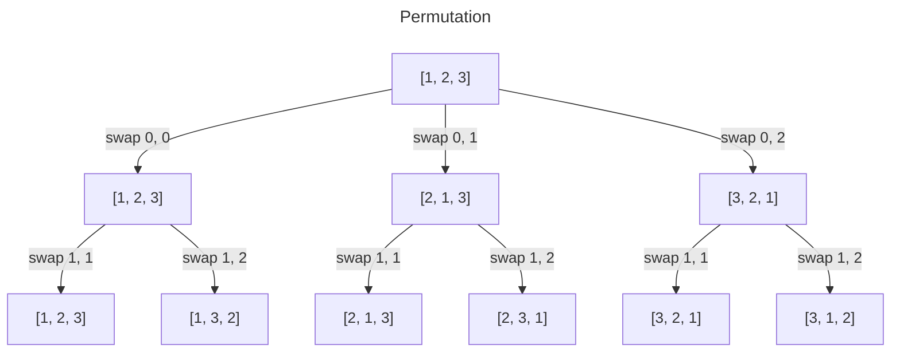

#### Backtracking

- What is backtracking?

Backtracking is an algorithmic approach to find solutions to problems that involve many possible paths.

- Solutions are built step by step
  - Involves controlled recursion
  - Modify state of the problem in place (make changes in place with pass by reference)
- If a path doesn't lead to a solution or it violates a constraints. Then that path is abandoned

- How is it different from simple recursion?

recursion is just a function that calls itself until it reaches a base case

Backtracking is a controlled recursion, means that if the recursion leads to an invalid path, then that path is abandoned

- How does backtracking work?

1. Explore one option
2. Keep building the solution with recursion
   - if the recursion leads to an invalid path, then abandon that path and backtrack to take another one
   - if solution is found, return it

ex: Sudoku solver

- Pure recursion -> brute force

- Pass by reference / change in place

Changes are made on the memory address of the variable (backtracking)
A copy of the variable is made in the memory each time (pure recursion)

#### Side note

#### Complexity analysis of combinations tree

