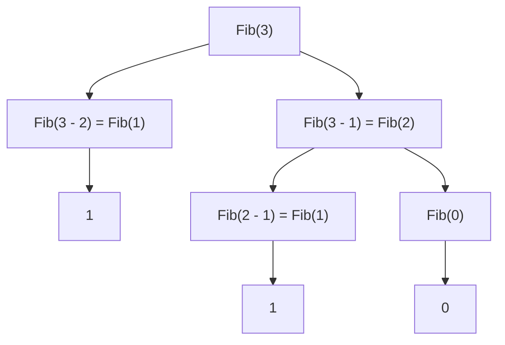

#### Recursion
A function `calling itself` until it approaches a `base condition`

#### Recursion Leap of Faith
1. Understand the problem (print 5! = 5*4*3*2*1)
2. Identify subproblem (5! = 5*4!)
3. Trust / Faith (solve the subproblem)
    - You have to trust that this recursive call will correctly solve a smaller
  version of your problem
    - No need to try to mentally simulate or unroll the recursion
    - Instead, you assume that if your function works for simpler cases it will
  work for more complex ones.
4. Link 1 & 2 (link the original problem and the subproblem)
    - func(n - 1) is called inductive step
5. Base condition

#### Recursion call stack
- Every call to a subproblem pushes that function call to what is known as a call stack. Stack is a specific kind of memory that is used to store local variables, function parameters, return addresses, and function calls within a function in order to keep of them and return to the parent function once the execution is finished.
- Call stack helps in calculating the space complexity

#### Recursion vs Iteration
- Things that can be done recursively can also be done iteratively
- `Iterative solutions` have better space complexity than recursive solutions **(in recursion each call allocates a memory space)**
- In `Recursion` you have `ascending phase` and `descending phase` **(call the next subproblem and return to the previous subproblem)**
- In `Iterative solutions` you have only the `ascending phase` **(you can only move to the next iteration, you cant go back)**

#### Ways to write base condition
Think about the:
- Last valid input
- or first invalid input

#### Recursion tree

- Fibonacci series can be defined as:
F(n) = F(n - 1) + F(n - 2) with `F(0) = 0` and `F(1) = 1`

0, 1, 1, 2, 3, 5, 8, 13, 21, 34, 55, 89, 144

let's visualize F(3)



Therefore Fib(3) = 1 + 1 + 0 = 2

#### Recursion approaches

- **0 to N**

In this case you need a new parameter that holds a value to be used in the base case
```
let func sum(current: int, n: int): int
sum(n) = 0 + sum(1, n) + sum(2, n) + sum(3, n) + ... + sum(n, n)
base case: current reaches n
```

When `current` parameter reaches `n`, the base case is reached

- **N to 0**

In this case it's not required to add a `current` parameter
```
let func sum(n: int): int
sum(n) = n + sum(n - 1) + sum(n - 2) + sum(n - 3) + ... + 0
base case: n reaches 0
```

#### Complexity Analysis of Recursion solutions

Time complexity = [number of nodes] * [work done per node]
Space complexity = [max depth]